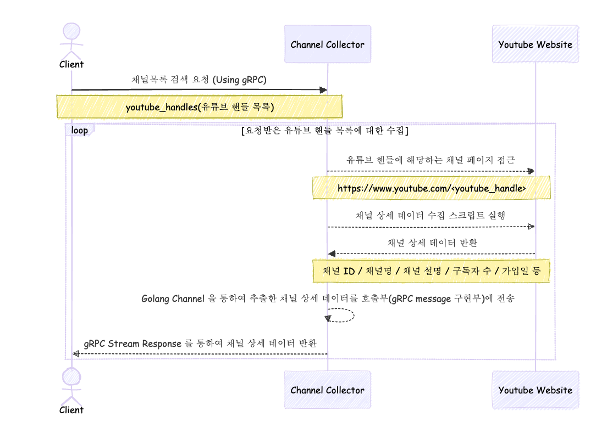

# YouTube Channel Details Collector

유튜브 채널 상세 데이터 크롤링을 위한 서비스입니다.<br/>
Channel ID / 채널명 / 설명 / 구독자 수 등 채널상세 페이지에 접근하여 데이터를 수집하고 요청량을 제어합니다.

## Requirements 
|                | Main version  |
|----------------|---------------|
| Go             | 1.24 or More  |
| Chrome Browser | 134.x         |

## Run

**Local**
```shell
# build
go build -o channel-collector cmd/main.go

# execute
./channel-collector
```

## Flow
요청받은 [유튜브 핸들](https://www.youtube.com/handle)에 해당하는 채널 페이지에 접근하여 채널 상세 데이터를 수집합니다. <br/>


**아래와 같은 요청량 제어 정책을 두어 IP Block 에 대비하고 있습니다.**
- 웹페이지 접근 및 스크롤 다운 등 유튜브 웹사이트에 대한 호출량을 초당 1번으로 제한

[gRPC 명세 이동](https://github.com/Sujin1135/channel-collector-interface/blob/main/protobuf/service/channel_service.proto)
